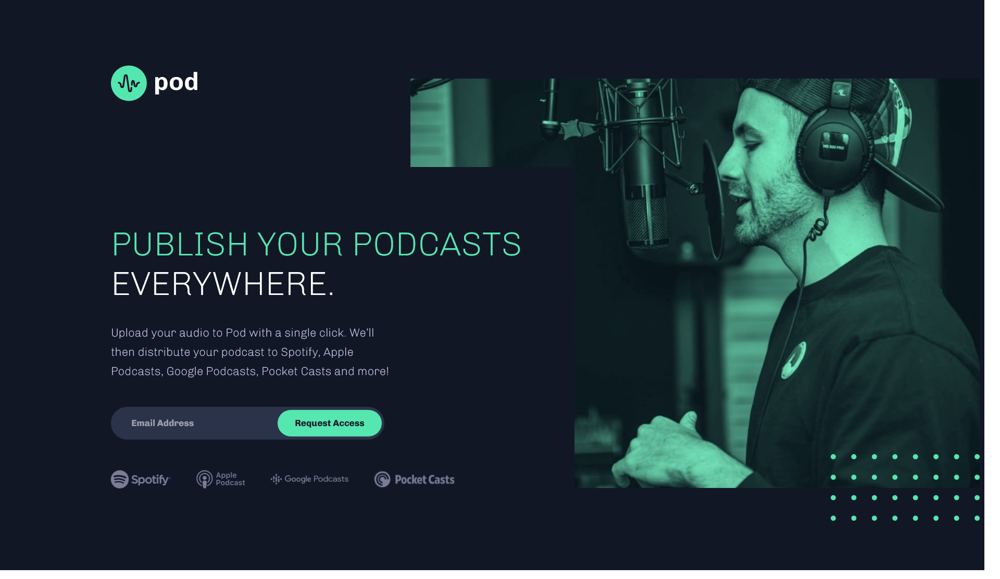

# Frontend Mentor - Pod request access landing page solution

This is a solution to the [Pod request access landing page challenge on Frontend Mentor](https://www.frontendmentor.io/challenges/pod-request-access-landing-page-eyTmdkLSG). Frontend Mentor challenges help you improve your coding skills by building realistic projects. 

## Table of contents

- [Overview](#overview)
  - [The challenge](#the-challenge)
  - [Screenshot](#screenshot)
  - [Links](#links)

### Screenshot

### Links

- Solution URL: [https://github.com/CarlosSimon02/fem-pod-request-access-landing-page](https://github.com/CarlosSimon02/fem-pod-request-access-landing-page)
- Live Site URL: [https://fem-pod-request-access-landing-page-carlossimon.vercel.app/](https://fem-pod-request-access-landing-page-carlossimon.vercel.app/)
